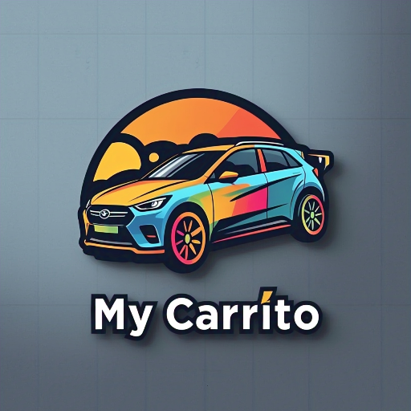

# Mi Carrito

<p align="center">
  
</p>

<p align="center">
  <strong>Marketplace de Autos Demostración</strong>
</p>

<p align="center">
  <a href="#características"><strong>Características</strong></a> ·
  <a href="#importante-aplicación-de-demostración"><strong>Nota Importante</strong></a> ·
  <a href="#instalación"><strong>Instalación</strong></a> ·
  <a href="#personalización"><strong>Personalización</strong></a> ·
  <a href="#tecnologías"><strong>Tecnologías</strong></a>
</p>

## 🚗 Introducción

Mi Carrito es una plataforma de marketplace especializada en la compra y venta de vehículos en México. Ofrece una experiencia completa para conectar compradores con vendedores de automóviles, incluyendo verificación de vehículos, opciones de financiamiento y agenda de pruebas de manejo.

## ⚠️ IMPORTANTE: Aplicación de Demostración

**Mi Carrito es una aplicación de demostración (mock app)** diseñada para servir como punto de partida para el desarrollo de marketplaces de automóviles reales. Esta aplicación:

- **NO** está conectada a una base de datos real
- Utiliza datos de muestra para ilustrar la funcionalidad
- Está pensada como estructura base para ser personalizada y adaptada a proyectos comerciales
- Requiere configuración adicional para ser utilizada en producción

Los desarrolladores pueden usar este código como un esqueleto bien estructurado para implementar sus propias soluciones de marketplace automotriz, ahorrando tiempo en la configuración inicial y enfocándose en las características específicas de su negocio.

## ✨ Características

### Centrado en el Sector Automotriz
- **Listados de Vehículos**: Presenta información detallada de automóviles (marca, modelo, año, kilometraje, etc.)
- **Búsqueda Especializada**: Filtros específicos para el sector automotriz
- **Verificación de Vehículos**: Sistema de verificación y certificación de automóviles
- **Opciones de Financiamiento**: Cálculo de pagos mensuales y opciones de financiamiento

### Experiencia de Usuario
- **Diseño Responsivo**: Optimizado para dispositivos móviles y escritorio
- **Temas Personalizables**: Modos claro/oscuro y paleta de colores adaptable
- **Interfaz Intuitiva**: Navegación fluida y accesible (WCAG 2.1)

### Funcionalidades Clave (Demostrativas)
- **Listados de Vehículos**: Presentación atractiva con toda la información relevante
- **Sistema de Búsqueda**: Filtros por marca, modelo, año, precio, etc.
- **Agendamiento de Pruebas**: Demostración de flujo para agendar pruebas de manejo
- **Autenticación**: Sistema de usuarios para compradores y vendedores

## 🚀 Instalación

### Prerrequisitos
- Node.js 18+ y npm/yarn/pnpm
- Para producción: Una cuenta en [Supabase](https://supabase.com)

### Instalación Local

1. Clona el repositorio
   ```bash
   git clone https://github.com/ROR2022/micarrito.git
   cd micarrito
   ```

2. Instala dependencias
   ```bash
   npm install
   ```

3. Configura las variables de entorno
   ```bash
   cp .env.example .env.local
   ```
   
   Edita `.env.local` según sea necesario (opcional para demo)

4. Inicia el servidor de desarrollo
   ```bash
   npm run dev
   ```

5. Visita [http://localhost:3000](http://localhost:3000) para ver la aplicación

## 🔧 Personalización para Proyectos Reales

### Conexión a Base de Datos

Para convertir esta demo en una aplicación real:

1. Configura un proyecto en [Supabase](https://supabase.com)
2. Actualiza las variables de entorno con tus credenciales de Supabase
3. Implementa las migraciones necesarias para crear las tablas requeridas
4. Reemplaza los datos mock con llamadas reales a la API

### Integración de Pagos

Para habilitar transacciones reales:

1. Integra un procesador de pagos como MercadoPago o Stripe
2. Configura webhooks para notificaciones de pagos
3. Implementa la lógica de negocios para comisiones y pagos a vendedores

### Personalización Visual

1. Actualiza logotipos e imágenes en la carpeta `public/`
2. Modifica colores y estilos en `tailwind.config.ts`
3. Adapta los componentes en `components/ui/` según sea necesario

## 🛠️ Tecnologías

- **Framework**: [Next.js 15](https://nextjs.org/) con App Router
- **Estilos**: [Tailwind CSS](https://tailwindcss.com) y [shadcn/ui](https://ui.shadcn.com)
- **Internacionalización**: [next-intl](https://next-intl-docs.vercel.app/)
- **Formularios**: [React Hook Form](https://react-hook-form.com/)
- **Base de Datos** (Para implementación real): [Supabase](https://supabase.com)

## 📋 Casos de Uso Recomendados

Esta base de código es ideal para:

- Startups que buscan lanzar un marketplace de autos
- Concesionarios que desean crear su plataforma digital
- Desarrolladores creando soluciones personalizadas para el sector automotriz
- Proyectos educativos sobre desarrollo de plataformas e-commerce

## 📝 Próximos Pasos para Implementación Real

1. **Configuración de Backend**: Implementar APIs y lógica de servidor
2. **Autenticación Real**: Conectar con proveedores de autenticación
3. **Procesamiento de Pagos**: Integrar pasarelas de pago
4. **Moderación de Contenido**: Implementar flujos de aprobación de listados
5. **SEO y Analytics**: Configurar seguimiento y optimización para buscadores

---

<p align="center">
  Este proyecto es una demostración y base para desarrollo. No está destinado a uso en producción sin personalización adicional.
</p>
